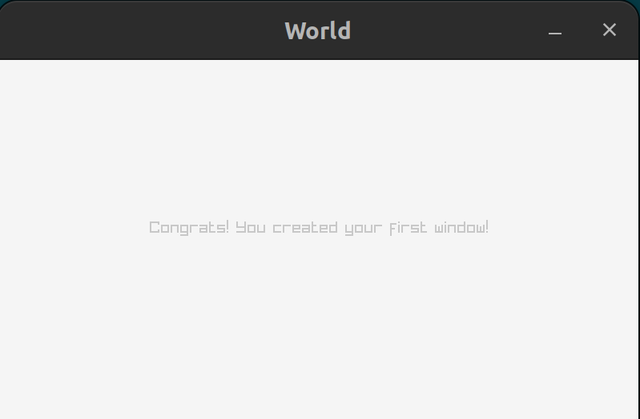

Here is a simple example on using raylib with prolog

Install raylib:  
https://github.com/raysan5/raylib/wiki/Working-on-GNU-Linux

`mkdir lib`
 and then add `libraylib.so` into it the folder

Build:
```
make 
```
and run:
```
./main
```
then you should see this window!  

